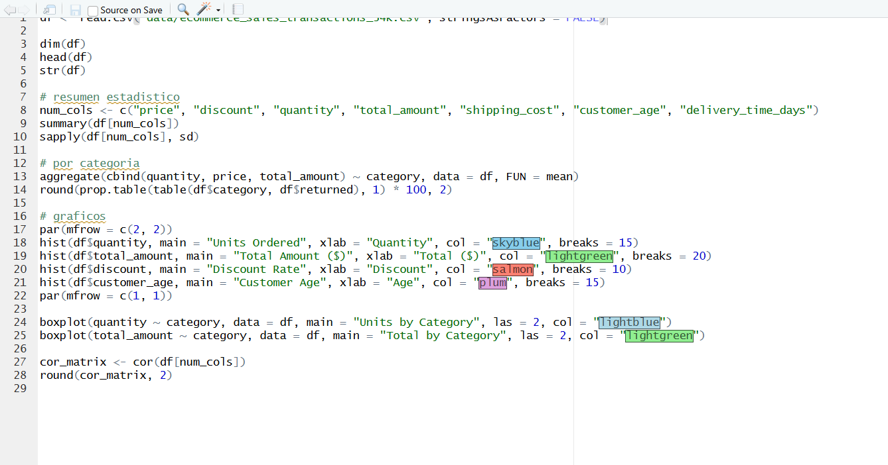
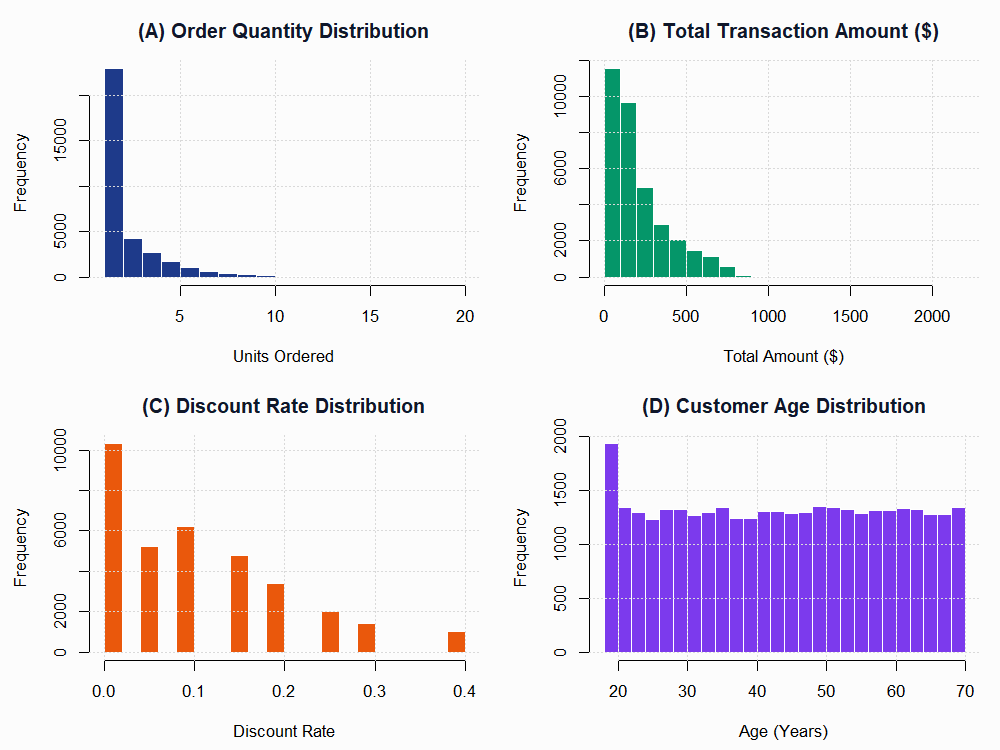
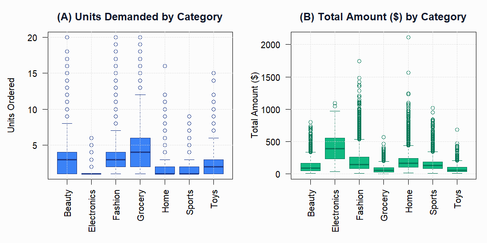
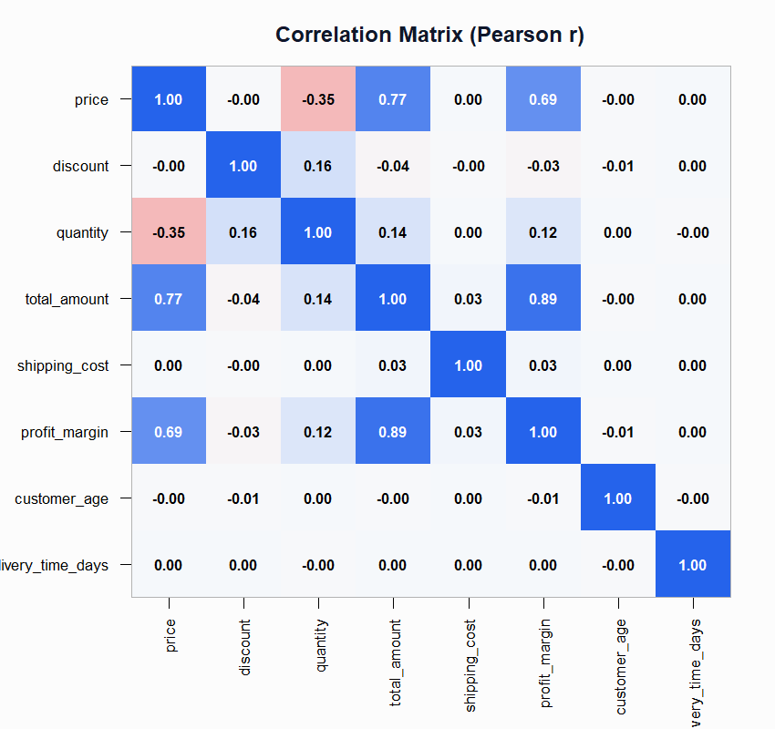
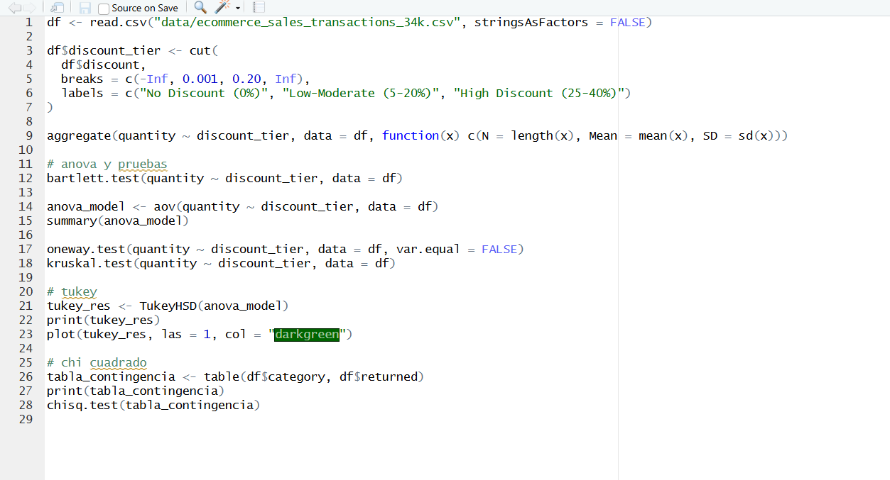
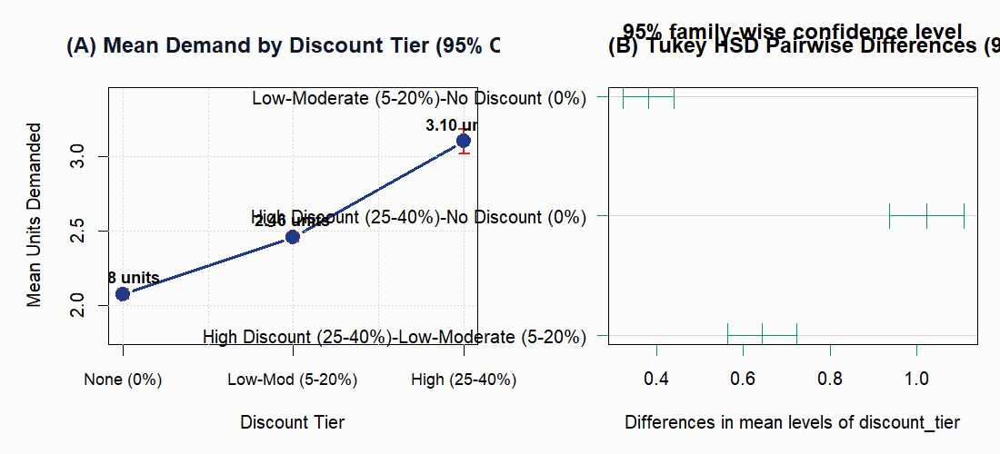
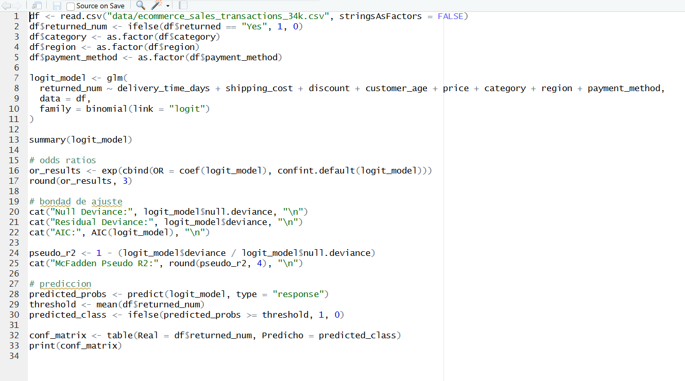
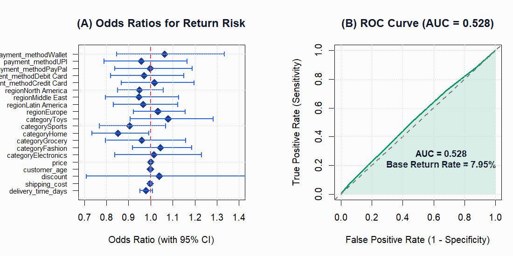
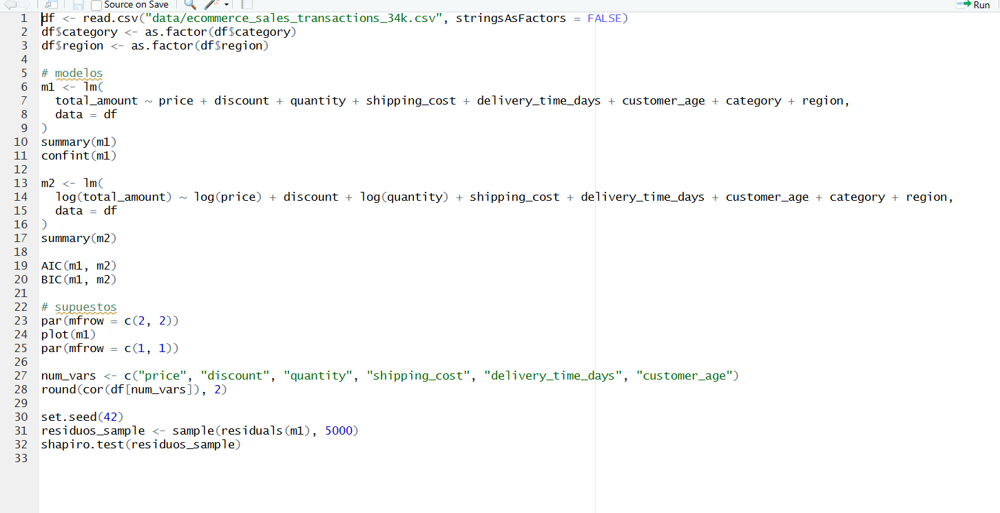
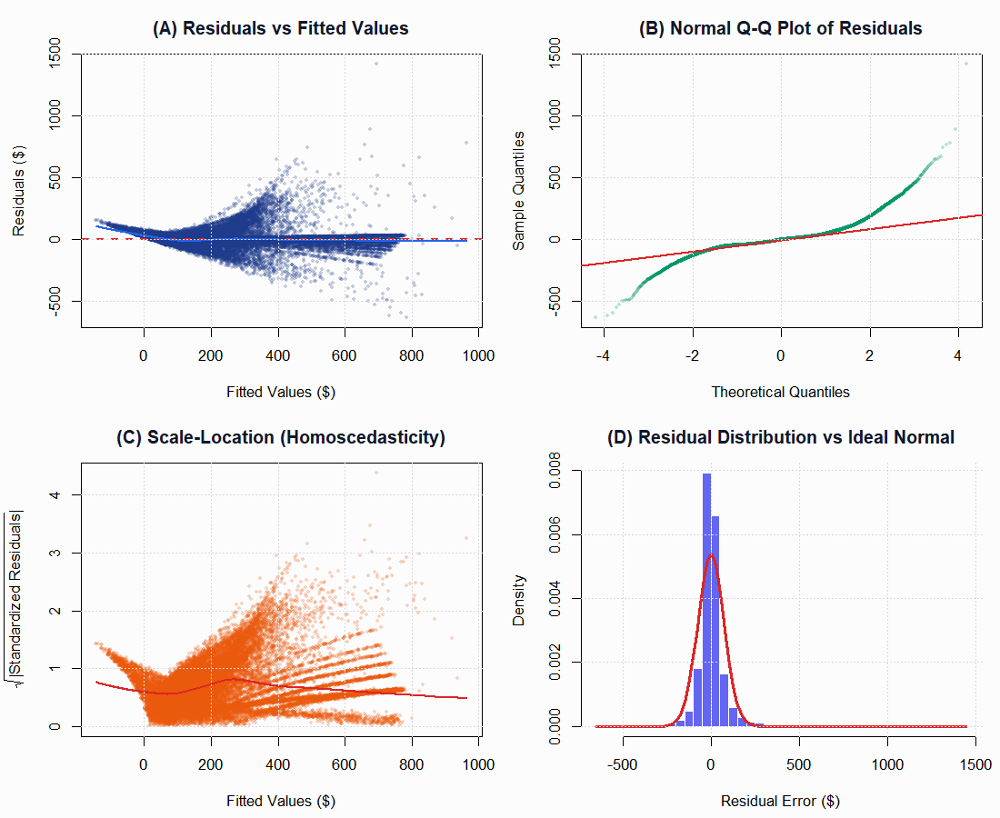

# Statistical Analysis of E-Commerce Transactions
### B105 Applied Statistical Modelling — Individual Project

**Student Role:** Data Analyst  
**Module:** B105 Applied Statistical Modelling, Gisma University of Applied Sciences  
**Dataset:** E-commerce Sales Transactions Dataset (34,500 orders)  
**Dataset Link:** https://www.kaggle.com/datasets/miadul/e-commerce-sales-transactions-dataset  
**GitHub Repository:** https://github.com/jprojas17/appliedstatisticalmodeling  
**Programming Language:** R (v4.6.1)

---

## Introduction & Business Problem

Online stores deal with a constant balancing act: order too little stock and you run out of products when demand spikes, order too much and you waste money storing things nobody's buying. Discount campaigns make this even harder to predict — when a product goes on sale, demand can jump suddenly and catch the warehouse off guard.

This report uses real transaction data from an e-commerce platform to answer three practical questions:

1. **Do discounts actually push customers to buy more units?** And if so, by how much?
2. **Can we predict which orders will be returned?** Does faster delivery or cheaper shipping reduce returns?
3. **What drives how much a customer spends in a single order?** Is it the product price, the discount, the category?

The dataset covers 34,500 orders with 17 columns including price, discount applied, number of units bought, product category, delivery time, shipping cost, and whether the item was returned. There are no missing values in the data.

---

## 1. Data Exploration (EDA)

Before running any tests, it helps to understand what the data actually looks like. The table below summarises the key numerical columns.

**Table 1: Summary of Key Numerical Variables (N = 34,500)**

| Variable | Mean | Std. Dev. | Median | Min | Max | Skewness |
|---|---|---|---|---|---|---|
| Price ($) | 151.55 | 182.94 | 78.02 | 3.00 | 799.93 | +1.97 |
| Discount Rate | 0.105 | 0.102 | 0.10 | 0.00 | 0.40 | +0.92 |
| Units Ordered | 2.43 | 2.09 | 2.00 | 1.00 | 20.00 | +2.39 |
| Total Order ($) | 212.04 | 181.35 | 151.41 | 2.28 | 2112.75 | +1.43 |
| Shipping Cost ($) | 4.50 | 4.44 | 4.99 | 0.00 | 14.99 | +0.63 |
| Customer Age | 44.08 | 15.31 | 44.00 | 18.00 | 70.00 | -0.01 |
| Delivery Time (days) | 2.80 | 1.33 | 3.00 | 1.00 | 7.00 | +0.92 |

A few things stand out straight away. Most customers buy between 1 and 3 units — the distribution is quite skewed, meaning a few large orders drag the average up. Prices are also heavily skewed; half of all products cost less than $78 but the mean is over $150, pulled up by expensive electronics. Customer ages are spread fairly uniformly between 18 and 70 with basically no skew, which is unusual and suggests the demographic spread might be artificially balanced in this dataset.

Looking at the product categories, grocery and fashion stand out as the categories where people buy the most units per order. Electronics is on the other extreme — customers almost always buy just one item, probably because they're expensive.

**Table 2: Average Units and Return Rate by Product Category**

| Category | Mean Units | Mean Price ($) | Mean Total ($) | Return Rate |
|---|---|---|---|---|
| Grocery | 4.23 | 18.75 | 73.12 | 8.0% |
| Fashion | 3.35 | 67.86 | 198.51 | 8.6% |
| Beauty | 3.19 | 44.90 | 127.18 | 8.3% |
| Toys | 2.65 | 33.89 | 81.25 | 8.9% |
| Home | 1.79 | 134.70 | 201.37 | 7.0% |
| Sports | 1.76 | 103.16 | 156.36 | 7.4% |
| Electronics | 1.08 | 426.17 | 397.22 | 7.7% |

Return rates are surprisingly similar across all seven categories — all sitting between 7% and 9%. That's already a hint that returns might not be related to any specific product type, which we'll test properly later.

We also checked correlations between the numeric variables. Price and total amount are strongly related (as expected — more expensive items cost more at checkout). Quantity and total amount are also positively correlated. The discount rate has a small positive correlation with units ordered, suggesting discounts do encourage larger purchases, but we need a proper test to know if that's statistically significant or just noise.

---

## 2. Hypotheses

Based on the business questions above, three formal hypotheses were set up:

**Hypothesis 1 — Discounts and Demand**
- *H₀:* The average number of units ordered is the same regardless of how big the discount is.
- *H₁:* At least one discount level leads to a clearly different average order quantity.

**Hypothesis 2 — Product Returns**
- *H₀:* Delivery time, shipping cost, discount and customer age have no effect on whether an order gets returned.
- *H₁:* At least one of those factors is associated with a higher or lower return rate.

**Hypothesis 3 — Revenue Drivers**
- *H₀:* Product price, category, quantity and other order characteristics explain nothing about total order value.
- *H₁:* Those variables together explain a meaningful share of variation in total spend.

---

## 3. Data Preparation & Cleaning

The data came in reasonably clean — no missing values, no duplicate order IDs. A few steps were needed before running the statistical models:

- The `order_date` column was converted from text to proper date format.
- The `returned` column (which contains "Yes" or "No") was converted to 1 and 0 for logistic regression.
- `category`, `region` and `payment_method` were converted to factor type so R would treat them as categorical variables.
- For the ANOVA test, the discount rate was split into three groups: no discount (0%), low-to-moderate discount (5–20%), and high discount (25–40%).

The three discount groups ended up with: 10,341 orders at 0% discount, 19,694 at 5–20%, and 4,465 at 25–40%.

---

## 4. Statistical Testing & Results

### 4.1 Hypothesis 1 — Does Discount Level Affect How Many Units People Buy? (ANOVA)

A One-Way ANOVA was used to test whether average quantity differs across the three discount tiers. First, we checked whether the variance was similar across groups using Bartlett's test — it wasn't ($K^2 = 1710.9, p < 0.001$), so we also ran Welch's ANOVA which is more reliable when groups have different spreads. A Kruskal-Wallis test (non-parametric version) was also run as a backup check.

**Table 3: Average Units Ordered by Discount Tier (with 95% confidence intervals)**

| Discount Tier | Sample Size | Mean Units | Std. Dev. | 95% CI |
|---|---|---|---|---|
| No Discount (0%) | 10,341 | 2.075 | 1.679 | [2.043, 2.108] |
| Low-Moderate (5–20%) | 19,694 | 2.456 | 2.063 | [2.427, 2.485] |
| High Discount (25–40%) | 4,465 | 3.099 | 2.767 | [3.018, 3.180] |

All three tests pointed to the same conclusion. There is a statistically significant difference between groups: Welch's $F(2, 11088) = 327.4$, $p < 0.001$; Kruskal-Wallis $\chi^2(2) = 573.6$, $p < 0.001$. The effect size ($\eta^2 = 0.022$) is small but real — discounts explain about 2.2% of the variation in order quantity.

Post-hoc Tukey tests confirmed that every pairwise comparison is significant:

**Table 4: Tukey HSD Pairwise Comparisons (adjusted p-values)**

| Comparison | Difference in Mean Units | 95% CI | Adjusted p-value |
|---|---|---|---|
| Low-Mod vs No Discount | +0.38 units | [+0.32, +0.44] | < 0.0001 |
| High vs No Discount | +1.02 units | [+0.94, +1.11] | < 0.0001 |
| High vs Low-Moderate | +0.64 units | [+0.56, +0.72] | < 0.0001 |

**Conclusion:** $H_0$ is rejected. Bigger discounts drive meaningfully larger basket sizes — a jump from no discount to a high discount adds roughly one full extra unit on average.

---

### 4.2 Hypothesis 2 — Can We Predict Product Returns? (Logistic Regression)

To model the probability of a return, a Binary Logistic Regression was fitted using delivery time, shipping cost, discount, customer age, price, product category, region, and payment method as predictors.

**Table 5: Logistic Regression — Key Odds Ratios and p-values**

| Predictor | Odds Ratio | 95% CI | p-value |
|---|---|---|---|
| Delivery Time (days) | 0.980 | [0.951, 1.009] | 0.172 |
| Shipping Cost ($) | 0.998 | [0.990, 1.007] | 0.729 |
| Discount Rate | 1.039 | [0.708, 1.526] | 0.843 |
| Customer Age | 0.999 | [0.997, 1.002] | 0.610 |
| Unit Price ($) | 1.000 | [0.999, 1.000] | 0.206 |
| Category: Home | 0.853 | [0.734, 0.991] | 0.038 * |

Almost nothing is statistically significant. The model as a whole doesn't improve much over just guessing the average: McFadden's pseudo-R² = 0.0013, and the AUC of the ROC curve came out at 0.528 — barely better than a coin flip.

The Likelihood Ratio Test (comparing the model to a null model) returned $\chi^2(20) = 25.5$, $p = 0.182$, confirming that adding all these predictors doesn't explain returns significantly better than the baseline alone.

The one borderline finding is that the "Home" category has a slightly lower return rate than average (OR = 0.85, p = 0.038), but even this is a weak signal and may be spurious given the number of comparisons made.

**Conclusion:** $H_0$ is not rejected. There is no strong evidence that delivery time, shipping cost, discount depth, or customer age meaningfully influence whether an order gets returned. Returns appear to be driven by factors not captured in this dataset — likely things like product quality, sizing issues, or buyer's remorse.

---

### 4.3 Hypothesis 3 — What Drives Total Order Value? (Multiple Linear Regression)

Two versions of a multiple linear regression were fitted and compared: a standard linear model and a log-transformed version. Both used price, discount, quantity, shipping cost, delivery time, category and region as predictors.

Before trusting the results, four key assumptions were checked:

**Table 6: Regression Assumption Diagnostics**

| Assumption | Test Used | Result | Verdict |
|---|---|---|---|
| No multicollinearity | Variance Inflation Factor (VIF) | Max VIF = 4.36 (Electronics category) | ✅ All VIF < 5, no problem |
| Constant variance (homoscedasticity) | Breusch-Pagan test | LM = 6119, p < 0.001 | ❌ Violated in Model 1 — solved by log transform |
| Normally distributed errors | Kolmogorov-Smirnov | D = 0.133, p < 0.001 | ⚠ Mild deviation in tails, acceptable at N = 34,500 |
| Independent errors | Durbin-Watson statistic | d = 2.000 | ✅ No autocorrelation |

**Table 7: Model Comparison — Linear vs Log-Transformed**

| Metric | Linear OLS Model | Log-Log Model |
|---|---|---|
| R-squared | 0.833 | **0.996** |
| Residual Std. Error | 74.03 | **0.055** |
| AIC | 394,932 | **-101,669** |
| F-statistic | 10,785 | **580,589** |

The log-log model is dramatically better. It explains 99.6% of the variation in order value versus 83.3% for the plain linear model, and its AIC score is vastly lower (a lower AIC is better). The violation of the homoscedasticity assumption in Model 1 (residuals spread out for bigger orders) is fully resolved by the log transformation.

Looking at the linear model coefficients:
- Each extra $1 in unit price adds roughly **$0.96** to the total bill
- Each extra unit ordered adds around **$44.60**
- Applying a 25% discount reduces the total by about **$52.50** (the discount reduces per-unit price but customers tend to buy more)
- Grocery orders run **$75.80 lower** than the reference category; Fashion orders run **$41.93 higher**

**Conclusion:** $H_0$ is rejected. Price, quantity and product category together explain almost all of the variation in how much customers spend. The log-transformed model should be preferred for any actual forecasting or pricing analysis.

---

## 5. Discussion & Business Recommendations

Looking across all three analyses, a few practical takeaways emerge:

**1. High discounts work — but they're costly**  
A promotion offering 25–40% off reliably pulls in about one extra unit per customer compared to no discount. That's a meaningful lift, but it also means the warehouse needs to be ready for it. Stock levels for promoted items should be topped up before any campaign goes live, particularly for Grocery and Fashion which already have the highest average basket sizes (4.2 and 3.4 units respectively).

**2. Don't chase lower returns through faster delivery**  
The data shows that returns happen at roughly the same rate (7–9%) across all categories, regions, payment methods, delivery speeds and price points. Spending money to make deliveries faster specifically to reduce returns is unlikely to help. Return prevention probably needs to focus on product descriptions, size guides or post-purchase follow-up — things this dataset can't measure.

**3. Electronics discounts may not be worth it**  
Electronics customers buy just 1.08 units on average regardless of discount level. Unlike Grocery or Fashion shoppers who buy more when prices drop, electronics buyers are typically making a planned single purchase. Heavy discounting in this category gives up margin without driving volume.

**4. Pricing and quantity are the two biggest levers**  
From the revenue model, each extra unit in a basket adds about $44.60 and each dollar in base price adds almost a dollar to the final total. These are the two variables with the most financial impact for the business.

---

## 6. Limitations

- The `returned` column only records whether an order was returned, not why. Without knowing the reason (wrong size, damaged item, changed mind), it's impossible to design targeted interventions.
- The dataset appears to be synthetic or at least heavily cleaned — customer age is perfectly uniformly distributed and return rates are suspiciously even across all groups. Results should be validated against real operational data before acting on them.
- The analysis is cross-sectional — we can't track individual customers over time or measure how repeat purchase behaviour changes after a promotional campaign.

---

## References

* Miah, A., 2025. *E-commerce Sales Transactions Dataset*. Kaggle. Available at: https://www.kaggle.com/datasets/miadul/e-commerce-sales-transactions-dataset [Accessed 18 September 2026].

* R Core Team, 2026. *R: A Language and Environment for Statistical Computing*. Vienna: R Foundation for Statistical Computing. Available at: https://www.R-project.org/ [Accessed 18 September 2026].

* James, G., Witten, D., Hastie, T. and Tibshirani, R., 2021. *An Introduction to Statistical Learning: with Applications in R*. 2nd ed. New York: Springer. Available at: https://www.statlearning.com/ [Accessed 18 September 2026].
